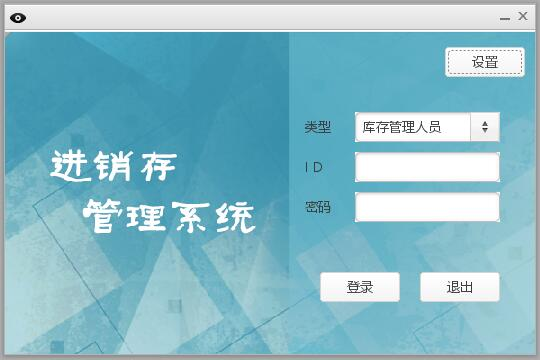
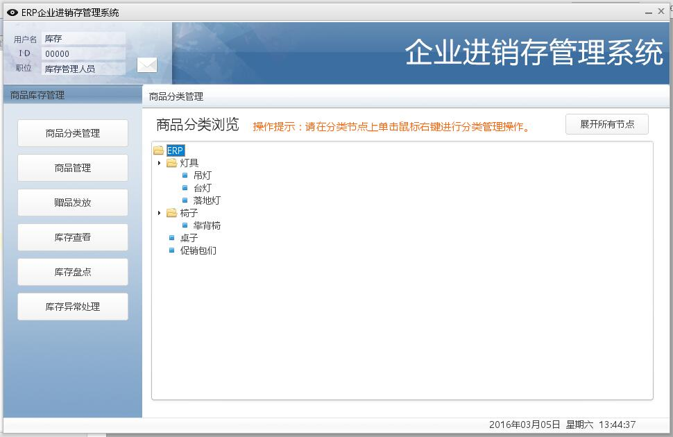
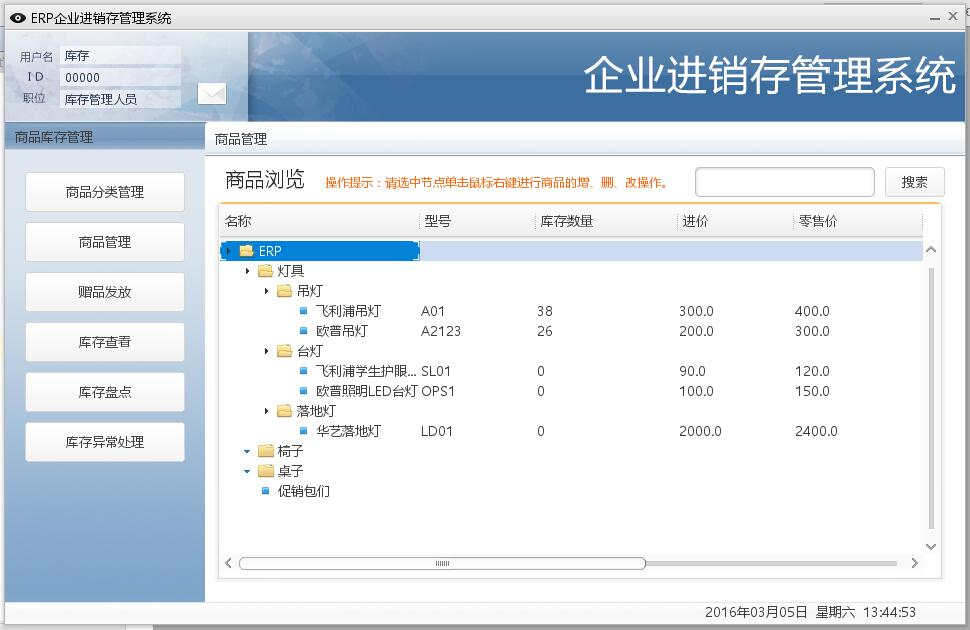
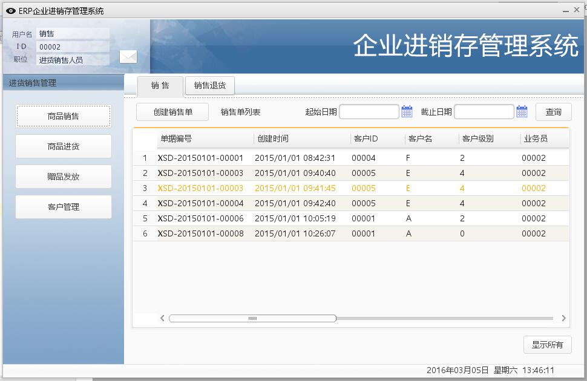
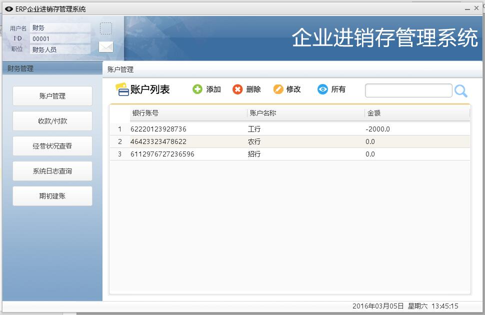
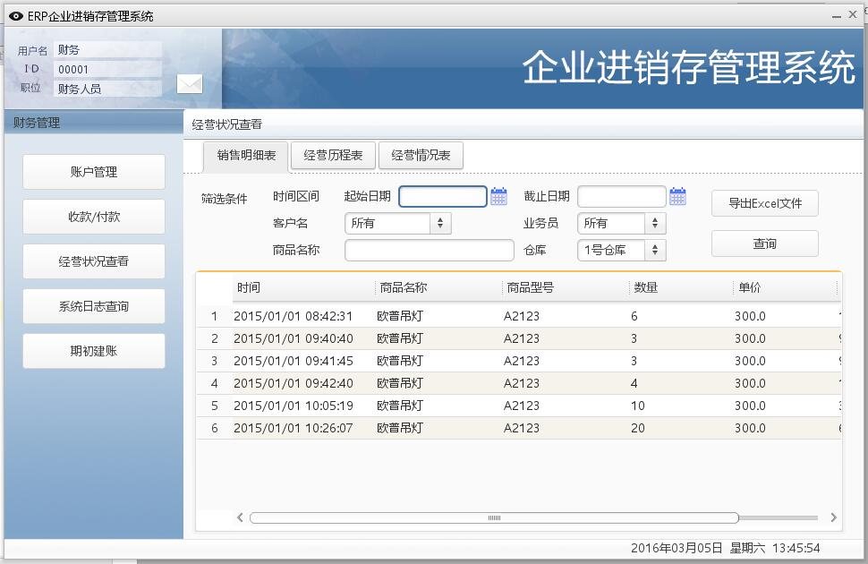
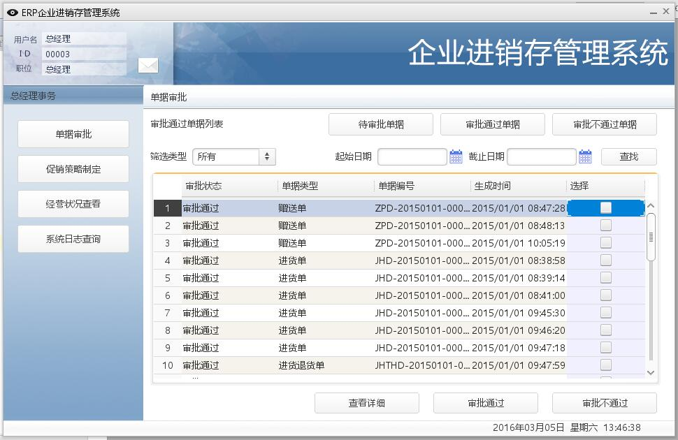

# ERPClient
Deworm的软工二大作业：进销存管理系统客户端

开发团队：Deworm

团队成员：

- [tomato990(对座)](https://github.com/tomato990)
- [vboar](https://github.com/vboar)
- [JaneLdq](https://github.com/JaneLdq)
- [oneoneO1](https://github.com/oneoneO1)

===
结合ERPServer使用.

可以以eclipse项目导入，也可以以maven项目导入。

注意：以maven项目导入需要自行添加lib文件夹中的包。

===
默认用户及其密码：

系统管理员：	admin admin

库存管理员： 	00000 123456

财务人员：		00001 123456

销售人员：		00002 123456

总经理：		00003 123456

===
客户端截图：

